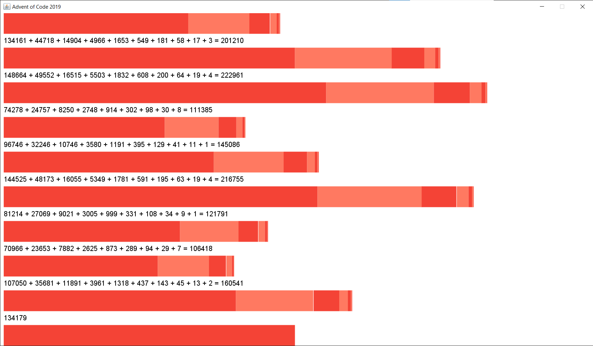

# Advent of Code 2019 (written in Cause 0.1.0)

This was an early stress test of the [Cause](https://github.com/dallonf/causelang) programming language, using a couple of [Advent of Code 2019](https://adventofcode.com/2019)'s puzzles as a test case. (this project was written in 2022; I was using the 2019 puzzles just because I hadn't gotten very far in that year before and, er, still haven't).

It even has some visualizations!

## How to run:

You can run it with: 

`gradle -q --console=plain run --args="-r cause [day]"`

(available days are 1 and 2 - and day 0 just has some hello world stuff)

Files in the `cause` directory are watched for changes and hot-reloaded, so you can mess with the language that way if you want!
